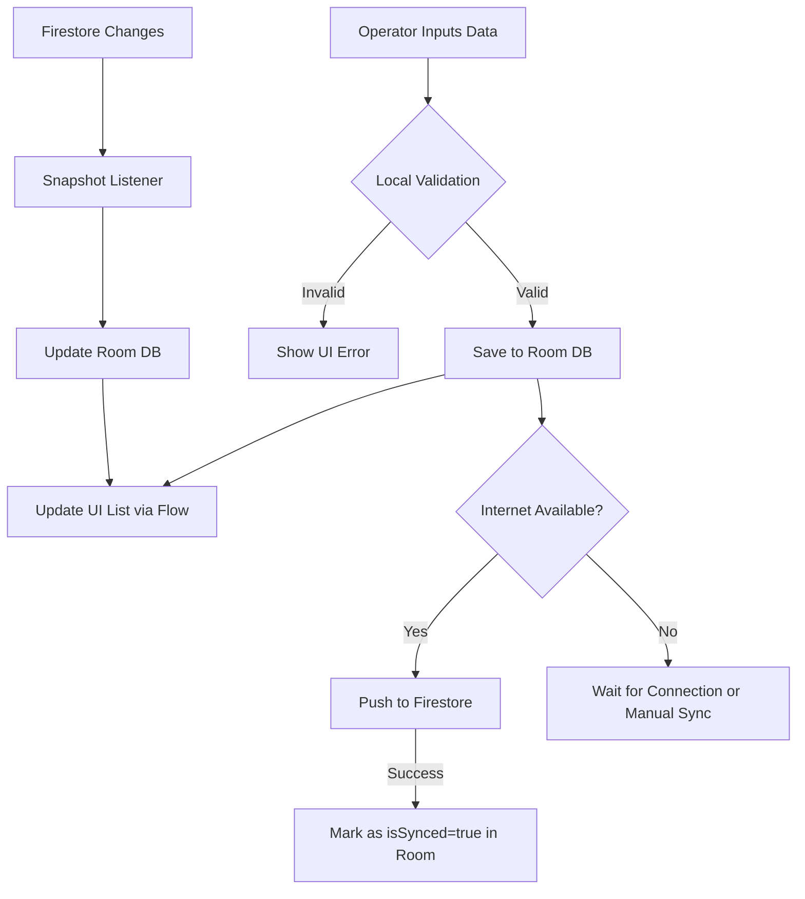

# Truck Weighbridge App - Sawit Pro Test

## Purpose
The Truck Weighbridge App is a specialized Android application designed to manage and track truck weight data in a robust, offline-first environment. It allows operators to record inbound and outbound weights, automatically calculates net weights, and ensures data is synchronized across the cloud using Firebase Firestore while maintaining a local Single Source of Truth (SSOT).

## Technical Stack
*   **Language:** Kotlin 1.8.10
*   **JDK:** 17
*   **Build System:** Gradle 8.1.1 with Version Catalogs
*   **UI Framework:** Jetpack Compose with Material 3
*   **Architecture:** MVVM (Model-View-ViewModel) + Clean Architecture principles
*   **Database:** Room (Local) & Cloud Firestore (Remote)
*   **Concurrency:** Kotlin Coroutines & Flow
*   **Navigation:** Compose Navigation (String-based for compatibility)
*   **Testing:** JUnit 4, MockK, Turbine, and Coroutines Test

## Project Structure
```text
com.jamalullail.sawitprotest
├── data
│   ├── local           # Room Database, DAOs, and Entities
│   └── repository      # SSOT Logic and Firebase Sync Implementation
├── domain
│   ├── model           # Domain models for UI/Business logic
│   └── mapper          # Extension functions for mapping between layers
├── ui
│   ├── theme           # Material 3 Design System (Colors, Typography)
│   ├── TicketViewModel  # State management and business logic orchestration
│   └── TicketScreens    # Jetpack Compose UI Components
└── MainActivity.kt      # Entry point and Navigation Host
```

## Key Features
1.  **Offline-First:** All data is saved to Room immediately. The app remains fully functional without internet.
2.  **Real-time Cloud Sync:** Uses Firestore snapshots to listen for remote changes and automatically merge them into the local database.
3.  **Dynamic Filtering & Sorting:** Support for searching and sorting by Date, Driver Name, and License Number directly via Room queries.
4.  **Live Validation:** Real-time net weight calculation and input validation (e.g., preventing outbound weight from exceeding inbound).
5.  **Manual Sync Trigger:** A dedicated sync button with a badge indicating the count of pending records.

## App Flow Diagram


## Dependencies
The project uses modern Android libraries managed via `libs.versions.toml`:
*   `androidx.room`: Local persistence.
*   `com.google.firebase:firebase-firestore`: Cloud storage.
*   `androidx.navigation:navigation-compose`: UI routing.
*   `app.cash.turbine`: Specialized Flow testing.
*   `io.mockk`: Mocking framework for unit tests.

## Quality Standards
The codebase is 100% compliant with **SonarQube** static analysis:
*   No hardcoded strings (all moved to `res/values/strings.xml`).
*   Injected Dispatchers for testability.
*   Low Cognitive Complexity through modularized Composables.
*   Strict adherence to PascalCase and camelCase naming conventions.

---
*Developed as part of the Sawit Pro Android Engineer Technical Test.*
